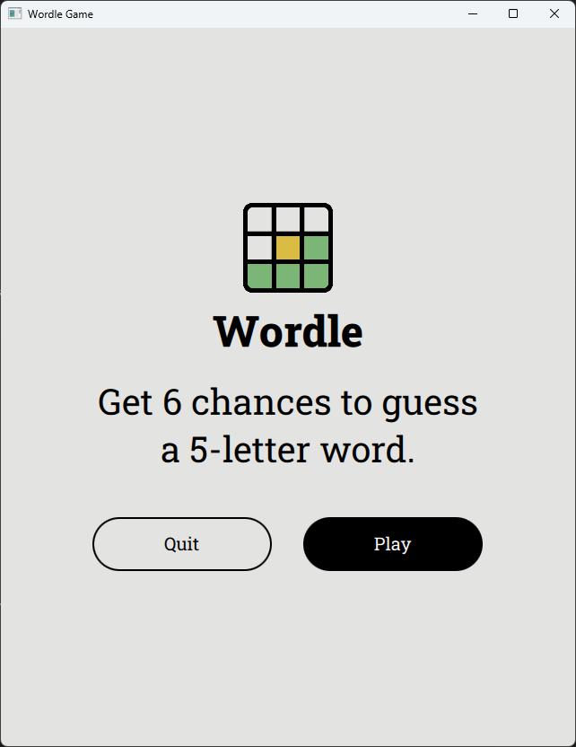
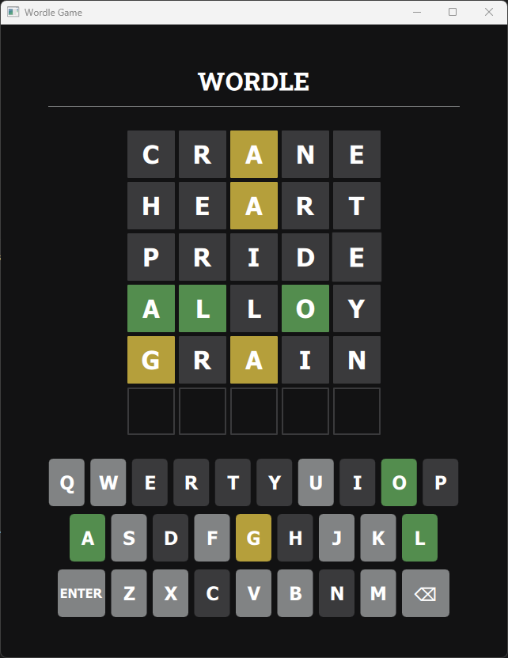

# Wordle Clone Game

A clone of the popular Wordle game built using **Qt 5.14**. The game features a grid-based word guessing interface and a virtual keyboard for letter entry. The player has six attempts to guess the correct five-letter word.

### Features

- **Virtual & Physical Keyboard Support**: Players can use the on-screen keyboard or their physical keyboard to input guesses.
- **Word Guessing**: Enter five-letter guesses and get feedback in the form of color-coded tiles.
  - Green: Letter in the correct position.
  - Yellow: Letter in the wrong position.
  - Gray: Incorrect letter.
- **Random Word Selection**: The game randomly selects a target word from a predefined word list.
- **Custom Target Word**: Players can set a custom word to be used as the target for every game.

### How to Play

1. **Press the Play button** on the main menu to start the game.
2. **Enter letters** using the on-screen virtual keyboard or your physical keyboard.
3. Press **Enter** to submit the guess.
4. You have **six attempts** to guess the correct word.
5. Letters will be color-coded to provide feedback:
   - Green: Correct letter and position.
   - Yellow: Correct letter, wrong position.
   - Gray: Incorrect letter.

### Screenshots

<table style="width:100%;">
  <tr>
    <td style="none"></td>
    <td style="none"></td>
  </tr>
</table>

### Installation

1. Clone the repository:
    ```bash
    git clone https://github.com/benediximuss/wordle-clone
    ```
2. Install Qt 5.14 and CMake.
3. Replace the path with the actual path to your Qt 5.14 installation in `CMakeLists.txt` by modifying the line `set(CMAKE_PREFIX_PATH "C:/Qt/Qt5.14.0/5.14.0/mingw73_64/lib/cmake")`.
4. Build the project using CMake.
5. Run the application.


### Notes
- The words list is stored in a text file, and you can change the dictionary source by updating the `filePath` property in `gamemanager.h`.
- You can set a custom target word by initializing `targetWord` property in `gamemanager.h`. Normally, the target word is picked randomly from the word list, but when `targetWord` is initialized, the same word will be used for every game round.
